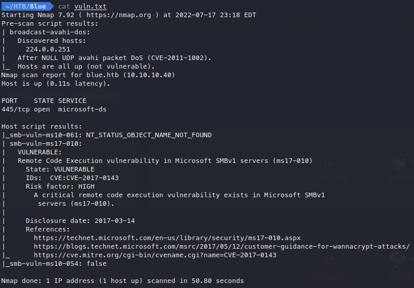

# Enumeration

## Nmap

Starting off I run a simple nmap scan of the box.

```bash
nmap -sC -sV blue.htb > nmap.txt
```

This is a Windows 7 box with quite a few ports open. Looks like this box is running SMB, which is what I’d like to enumerate further.


## SMB

Nmap has a set of scripts that can be used to further enumerate specific services. I’ll run another nmap scan on just port 445 using a vulnerability script to check for any known vulnerabilities for the SMB running on this machine.

```bash
nmap -p 445 -script vuln blue.htb > vuln.txt
```

The script shows that the box is vulnerable to CVE-2017-0143 AKA EternalBlue.



# Exploitation

## EternalBlue

EternalBlue is a remote code execution vulnerability in older versions of Windows SMB. Because it’s a pretty well known exploit, theres plenty of metasploit modules that will get the job done. Because I’m studying for the OSCP, I would like to avoid metasploit as much as possible, and will find another way to exploit this vulnerability.

A quick search returns [this](https://github.com/3ndG4me/AutoBlue-MS17-010.git) GitHub exploit which seems not terribly complicated. I’ll clone the repo into my directory with:

```bash
git clone https://github.com/3ndG4me/AutoBlue-MS17-010.git
```

Once the repository is cloned, I’m ready to start crafting the payload.


Within the repository there is a shellcode directory, with a shell_prep shellscript that uses msfvenom to craft the shellcode I’ll be sending to the machine to run. I input my IP and port, and tell it to generate a normal cmd shell as a stageless payload.


I set up a `netcat` listener to catch my reverse shell, and run the python script in the main directory, targeting the box with the `sc_x64_msf.bin` shellcode. I am met with an impacket error, telling me that I don’t have impacket installed. 


This is an issue I’ve had before, even though I do have impacket installed. I tried uninstalling and reinstalling the modules and still recieve the same error, so I decide to try running the script in `python3`. This time, the exploit starts to work, but then hangs before generating the shell.


Since I am not 100% sure I’m using the correct shellcode, I decide to try the `sc_all.bin`, which sounds like a more general payload. This time I’m given a “No route to host” error, so now I’m starting to think I may have crashed the box.


When I ping the box it hangs for a second, but does respond pretty quickly.


I’ll try the same payload again and see if the box was just down momentarily. This time it works, but gets stuck before generating the reverse shell once again.


Before giving up on this script, I decide to try one more shellcode, `sc_x64.bin`. Thankfully, it works and I’m given a shell almost immediately!


A `whoami` command reveals that I have been given a system shell, and will not have to escalate priviledges at all.


## Flags

I navigate to the Users folder and find a user named haris. On haris’ desktop is the user flag.


The root flag is on the Administrator’s desktop as usual.


