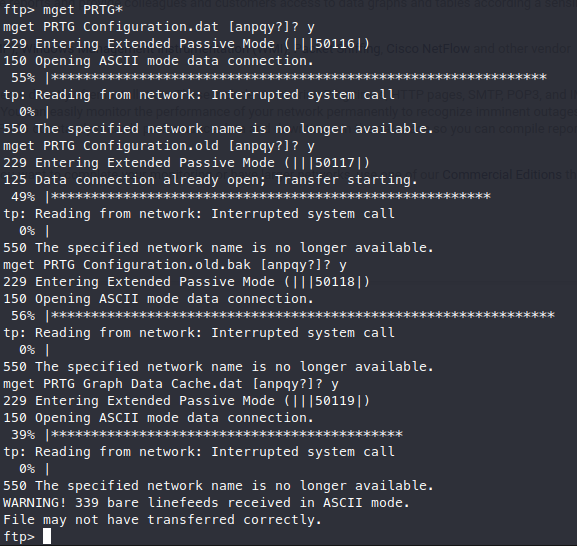

# Enumeration

## Nmap

I start off by running my usual nmap scan:

```bash
nmap -sC -sV netmon.htb > nmap.txt
```

This is a Windows machine running a few interesting things.


The FTP is configured to allow anonymous login, which is always fun. In addition to this, it seems to be serving up the operating system, which is not something I’ve seen before. This should be able to provide access to a user flag, however because I’m unfamiliar with the web service running on port 80 I’d like to check that out first.

## Website

The website is a login page for a service called PRTG Network Monitor.


The first thing I always do with things like this is look for default credentials. I’m able to locate the [user manual](http://pcdienbien.com.vn:6868/help/login.htm), which reveals the default credentials of prtgadmin:prtgadmin. Unfortunately, these credentials don’t work, and I don’t want to try brute forcing this just yet.

Next I’ll try to see if there are any vulnerabilites associated with this application. The first list of [CVEs](https://www.cvedetails.com/vulnerability-list/vendor_id-5034/product_id-35656/Paessler-Prtg-Network-Monitor.html) I look at has quite a bit of information. One that sticks out to me is CVE-2018-9276, which allows for command injection, however this exploit looks like it requires access to the Administrator Console which I do not at this point.

This avenue seems like a dead end until I can gain access to the Administrator Console, so I think it’s time to take a look and see what I can find via FTP.

## FTP

As shown in the nmap, FTP is serving up the entire drive.


### User Flag

First, since I have access to the whole drive, I’ll go check for a user flag. Sure enough, it’s sitting in `Users\Public\`! I’ll download the flag to my system and submit it.


Just in case, I check to see if the Administrator directory is available as well, however it isn’t. I want to head back and see if I can find where the PRTG files are stored. Checking the [user manual](https://www.paessler.com/manuals/prtg/data_storage) again shows that the directory is under `ProgramData\Paessler\` . Navigating to the PRTG Network Monitor folder shows a ton of logs, and most importantly the configuration files.


I run `mget` on any file starting with PRTG to download all of the configuration files to further inspect.



## Configuration Files

Instead of manually searching through each configuration file, I `cat` all of them out and `grep` for admin, just to see if I can find any hits. One of the files has a username of prtgadmin, which is the default username I found earlier! I expand my search by using `-A 10` to include the 10 lines before the hit, and `-B 10` to include the 10 lines after the hit, this time searching for prtgadmin. Sure enough, I get a password of PrTg@dmin2018 listed!


I head back to the login page with my new credentials, but they don’t work. Luckily, I remember that one of the configuration files had a `.old` extension, so I decide to try changing the year in the password. With prtgadmin:PrTg@dmin2019, I am granted access to the System Administrator Console!


Now that I have access, I should be able to use the command injection vulnerability I identified earlier in my enumeration.

# Exploitation

## Network Monitor

Before I do anything on the Administrator Console, I do some more research on CVE-2018-9276. One of the more interesting articles I’m able to find is [this](https://www.codewatch.org/blog/?p=453) blog post detailing how the vulnerability was found.

The way the vulnerability works is that there is a test notification that is part of the application by default. This script is vulnerable to the command injection because it doesn’t sanitize user input. 

Although there is a metasploit module for this exploit, it seems simple enough to do manually, so I’ll try it myself. The notification page is under *Setup → Account Settings → Notifications.* 


## Reverse Shell

Although I could test the exploit first, I decide to go for the reverse shell right off the bat. I head to [RevShells](https://www.revshells.com/) to create a powershell one liner for the exploit. RevShells is one of my go to tools for situations like these, because of the wide variety of payloads it contains. I input my IP and port and can copy the powershell command to use for the exploit!


Back on the Administrator Console, I create a new notification. Scrolling down a little bit allows me to execute a program when the notification fires. The vulnerable script is called *Demo exe notification - outfile.ps1.* In my case I set my parameter as “rev;” followed by my payload. The “rev” is the parameter that the script takes in. When followed by a semicolon, anything after will be executed as PowerShell code.


When I hit save, I get sent back to the notifications page. First, I head back to my terminal to set up a `netcat` listener to catch the reverse shell. Selecting my notification brings up a drop down with a few options. I’ll select the bell icon to test the notification.


After the test notification is triggered, the shell is sent back to my listener. I run `whoami` and see that this is indeed a system shell!


## Root Flag

All that’s left to do is head to the Administrator desktop and grab the root flag!


